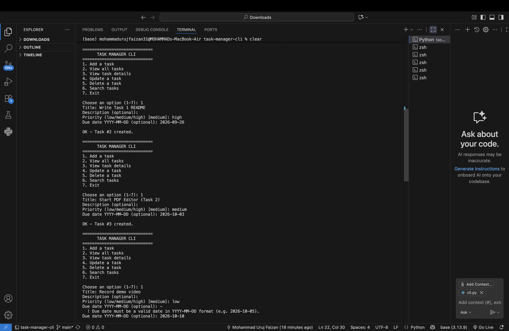
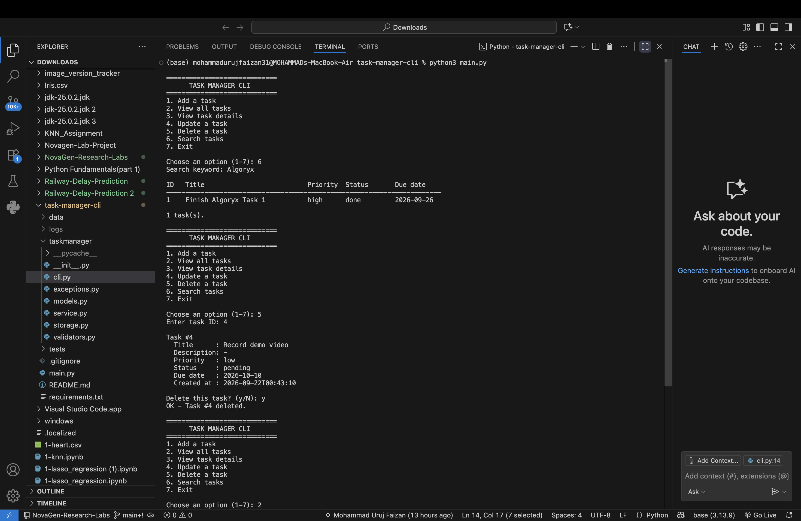
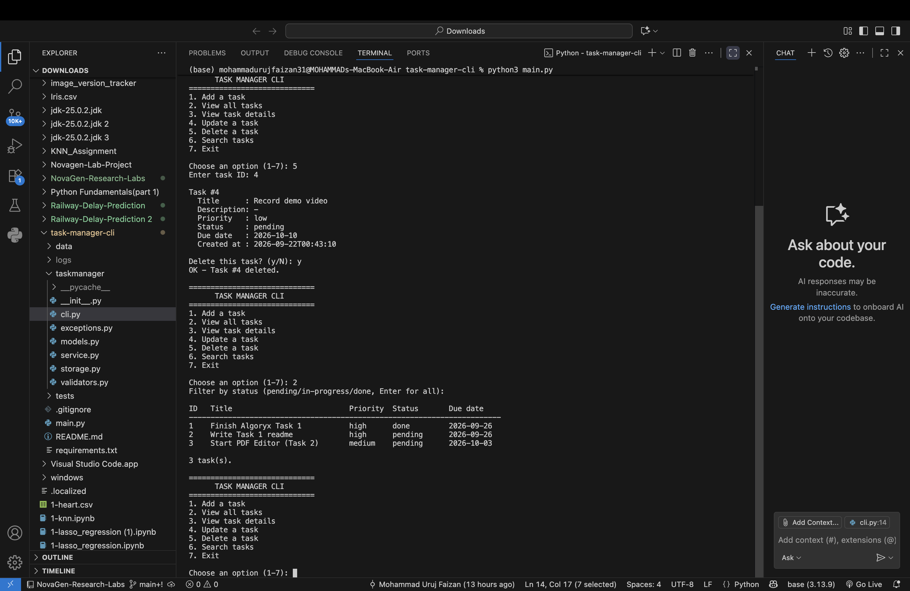

# Task Manager CLI

A professional, menu-driven command line application for managing tasks, with full **CRUD** operations, search, input validation, and persistent **CSV** storage. Built with pure Python (standard library only).

## Features

- **Create** tasks with title, description, priority, and due date
- **Read** all tasks in a table, filter by status, or view one task in detail
- **Update** any field (press Enter to keep the current value, `-` to clear)
- **Delete** with a confirmation prompt
- **Search** by keyword in title or description (case-insensitive)
- **Persistent storage** in a CSV file, written atomically to prevent corruption
- **Input validation** with clear error messages and re-prompting
- **Exception handling** with custom errors, plus logging to `logs/taskmanager.log`
- **Unit tests** for business logic and storage


## Screenshots

**Task list**


**Add / update a task**


**Search**


**Delete a task**


## Requirements

- Python 3.11 or newer
- No external dependencies

## Installation

```bash
git clone https://github.com/uruj04/task-manager-cli.git
cd task-manager-cli
```

## Usage

```bash
python main.py
```

Use a different data file:

```bash
python main.py --file my_tasks.csv
```

### Menu

```
1. Add a task
2. View all tasks
3. View task details
4. Update a task
5. Delete a task
6. Search tasks
7. Exit
```

### Field rules

| Field       | Rules                                        |
|-------------|----------------------------------------------|
| Title       | Required, max 80 characters                  |
| Description | Optional, max 300 characters                 |
| Priority    | `low`, `medium` (default), or `high`         |
| Status      | `pending` (default), `in-progress`, or `done`|
| Due date    | Optional, valid date as `YYYY-MM-DD`         |

## Project Structure

```
task-manager-cli/
├── main.py                  # Entry point
├── taskmanager/
│   ├── cli.py               # Menu, prompts and output formatting
│   ├── service.py           # CRUD + search business logic
│   ├── storage.py           # CSV persistence (atomic writes)
│   ├── validators.py        # Input validation
│   ├── models.py            # Task dataclass and constants
│   └── exceptions.py        # Custom exceptions
├── tests/
│   └── test_task_manager.py # Unit tests
├── data/                    # tasks.csv is created here on first run
├── requirements.txt
└── README.md
```

## Architecture

The code is split into layers so each part has one job:

**CLI** (`cli.py`) → **Service** (`service.py`) → **Storage** (`storage.py`)

- The CLI only handles user interaction; it contains no business rules.
- The service validates data and applies CRUD/search logic.
- The storage layer only reads and writes CSV, so it can be swapped for JSON or SQLite without touching the rest.

## Running Tests

```bash
python -m unittest discover -v
```

## Author

**<Your Name>** — Python Internship, Algoryx
[LinkedIn](https://linkedin.com/in/mohd-uruj-a1207038a) · [GitHub](https://github.com/uruj04)
